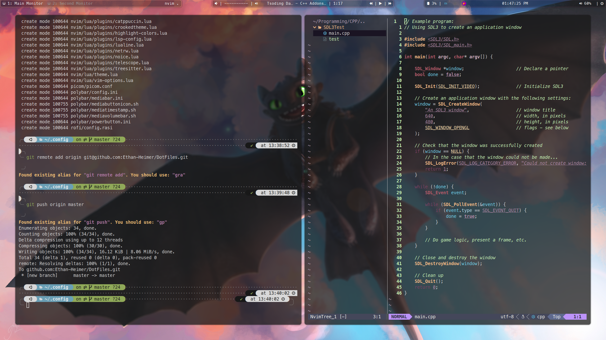

# The Crooked Config!

This is the config I use for my personal desktop, which looks like this when configured right:

## About

### Alacritty

The Alacritty terminal emulator works the best for this setup. Theres is a Wezterm config
included, however there seems to be a bug with Wezterm and Picom that causes XOrg to 
use 100% CPU. So Alacritty it is. 

The Config is super simple as all it does is set the font and style the terminal window.

### i3

i3 is a tiling windows manager. The config here is a lot, but here are the important bits:

- Desktop wallpaper is set in the `$wallpaper` variable. You must use the the absolute path of the wallpaper
- `$terminal` defines what terminal command is ran when `$mod+Return` is pressed. By Default its Alacritty.
- By default, window focus and movement keys are 'j', 'k', 'h', 'l' to resemble VIM
- The terminal and firefox are opened on startup.
- 'feh', 'picom', and 'polybar' are all executed at startup.

picom and polybar has there own configs elsewhere, however 'feh' is configured here.
'feh' is used to display the wallpaper.

Some extra keybinds defined in the config:
- `$mod+shift+x` executes 'i3lock' to lock the screen.
- `$mod+shift+p` executes 'flameshot GUI'- a screenshot tool.
- `$mod+shift+d` executes 'discord'.
- `$mod+shift+s` executes 'spotify'.
- `$mod+d` executes 'rofi' as a Dmenu replacement.

This config is dependent on many other applications to work, so it might break if one is missing.

### NeoVim

Neovim configs can get long, so this is only a surface level explanation for future reference.
This config is using the 'Lazy' package manager. The packages used are as follows:

- `'ethan-heimer/crookedtheme'` is a theme manager, `'ethan-heimer/crookedteeth'` is the theme
- `"williamboman/mason.nvim"`, `"williamboman/mason-lspconfig.nvim"`, and `"neovim/nvim-lspconfig"` handle installing and using Language Servers.
- `"nvim-lualine/lualine.nvim"` adds a better looking status bar.
- `'prichrd/netrw.nvim'`, `'nvim-tree/nvim-tree.lua'`, and `'nvim-tree/nvim-web-devicons'` configure and add a file tree to the side. 
- `"folke/noice.nvim"` just makes things look good!
- `'nvim-telescope/telescope.nvim'` is used to GREP and find files.
- `"nvim-treesitter/nvim-treesitter"` is used for better syntax highlighting. 

Each package is configured in the `/nvim/lua/plugins/` directory, more information on the configuration can be found there.
This config should be pretty much plug and play, Lazy should install its self if needed, and install all missing packages.
Mason should install all requiered LSPs. By default 'lua_ls', 'ts_ls', and 'clangd' LPSs are installed. 

Some other information, 'theme.lua' enables transparent backgrounds, and 'vim-options.lua' handles vim keybinds.

### PiCom
Picom is a compositor, and is what allows windows to be blured and have rouned corners. The config is simple- it just enables the blur and rounded corners.

### Polybar
Polybar is the status bar at the top of the screen. The config can get tricky, but at the surface theres three bars.
- The leftmost bar displays workspace and window information. 
- The center bar is a custom media module (found [here](https://github.com/Ethan-Heimer/Mediabar)) that controlls media. 
- The right bar contains everything else!

`playerctl` is requiered for the center media bar to work. 

### Rofi
Rofi is used as a replacement for Dmenu. The config file mostly handles styling. Nothing crazy.
